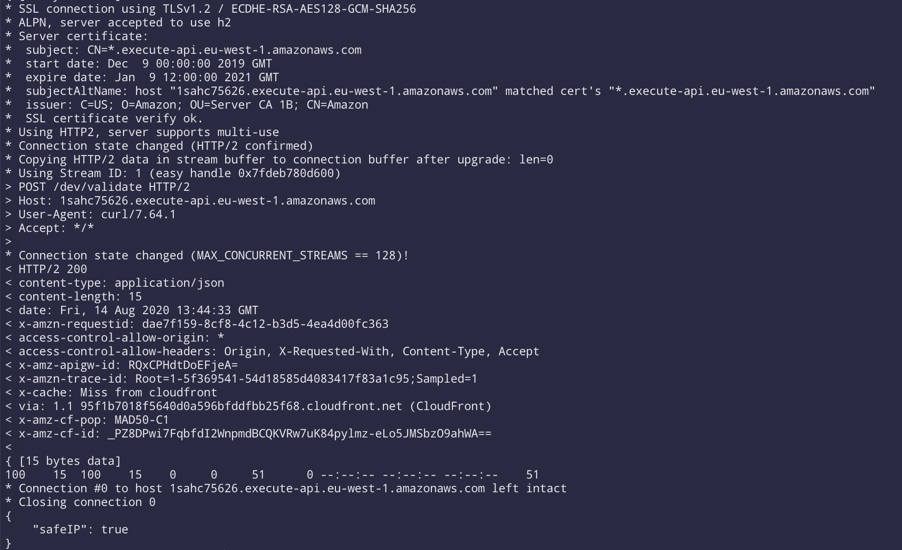
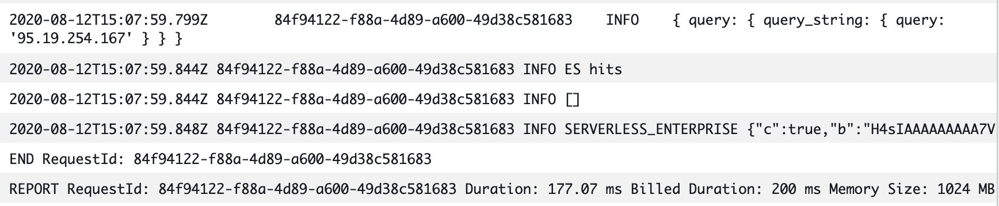
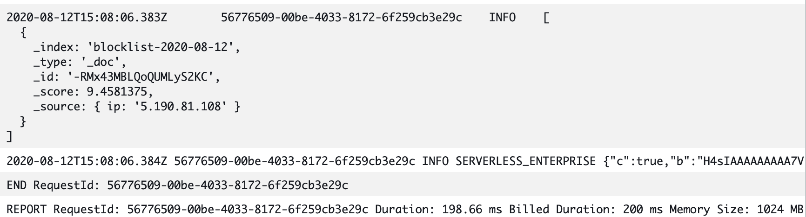
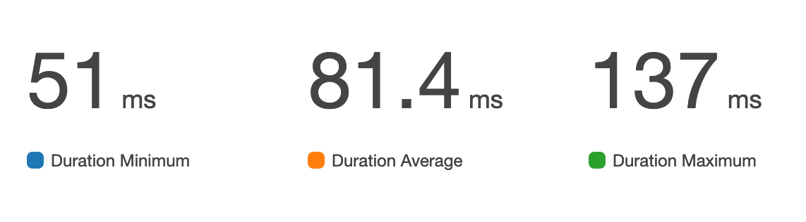
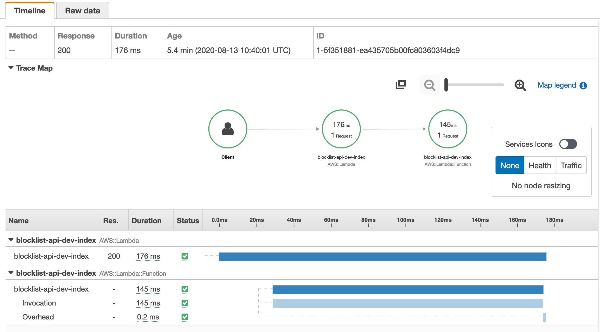

# Blocklist API


The API receives input via two selected options, either by using the HTTP X-Forwarded-For header to determine the original client IP or via an IP specified via a query string parameter.

If an entry exists in ElasticSearch, it means we have it marked as an unsafe IP address and return not safe, otherwise it is marked as safe.

The idea is to have a function that is called in the middle of a user facing workflow so speed is critical to UX.

### Instructions

To use simply send a HTTP POST request to your url in the following format.

`curl -x POST https://<my_endpoint>.eu-west-1.amazonaws.com/dev/validate`

##### Sample Response via Postman

```json
{
    "safeIP": true
}
```

##### Sample curl response



##### Sample response for an ElasticSearch hit


##### Sample response for an ElasticSearch miss

 
### Performance

The performance is really quick, enough to be in a direct customer facing position with minimal impact. For example, the lambda execution takes less than 100 milliseconds to query elasticsearch with hundreds of thousands of records and return the result.



The overall time requests spend on our infrastructure is minimal, and you can see a detailed breakdown of performance via this X-Ray screenshot.


